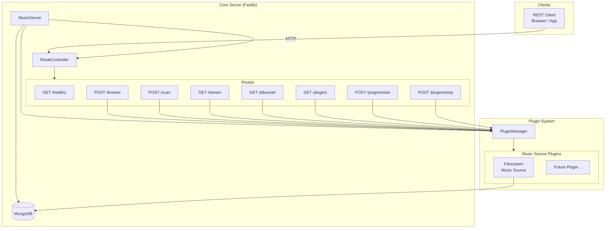

# Music Server – Architecture

## Introduction

**Music Server** is a lightweight, self-hosted music streaming server built for broad compatibility.
All client interaction is handled through well-defined **REST APIs**, making it easy to integrate
with any HTTP-capable client, whether a web browser, a mobile app, or a third-party application.

From day one, the server is built around the concept of **plugins**.
Every music source is a plugin that can be loaded, started, or stopped at runtime without modifying
the core server.  This design allows the server to be expanded with new capabilities simply by
dropping a new plugin directory into the configured plugin folder – no rebuild required.

---

## Architecture

The following diagram shows the main building blocks of the server and the relationships between them.



### Building Blocks

| Component | Location | Responsibility |
|---|---|---|
| **MusicServer** | `src/server/music_server.ts` | Top-level orchestrator. Boots the database, the Fastify HTTP server, and the plugin system in sequence. |
| **Database** | `src/server/database.ts` | Wraps the MongoDB connection. Initialises all collection models at startup. |
| **RouteController** | `src/routes/routeController.ts` | Iterates over every `Route` instance and registers it with the Fastify instance. |
| **Route (abstract)** | `src/types/route.ts` | Base class for all HTTP handlers. Each concrete route declares its method, URL, optional JSON schema, and `handler` logic. |
| **PluginManager** | `src/plugins/pluginManager.ts` | Discovers plugin directories under `$PLUGIN_DIR`, dynamically imports each `index.js`, persists plugin state in MongoDB, and manages `start` / `stop` lifecycle calls. |
| **Plugin (abstract)** | `src/types/plugins/plugin.ts` | Base class every plugin must extend. Defines `id`, `name`, `category`, `start()`, and `stop()`. |
| **MusicSourcePlugin (abstract)** | `src/types/plugins/music_sources.ts` | Extends `Plugin` with the four music-specific operations: `scan()`, `browse()`, `stream()`, and `getAlbumArt()`. |
| **Filesystem Music Source** | `src/plugins/music_sources/filesystem-music-source/` | Reference plugin implementation. Recursively scans a local directory for audio files, parses metadata with `music-metadata`, stores results in MongoDB, and serves audio streams directly from disk. |
| **MongoDB Collections** | `src/types/db/` | Four collections – `plugins`, `songs`, `albums`, `artists` – hold all persistent state. |

---

## API Reference

A machine-readable [OpenAPI 3.0 specification](./openapi.yaml) is available for download.
It can be imported directly into tools such as Swagger UI, Postman, or Insomnia.

The following sections summarise each endpoint.

---

### `GET /healthz`

Returns the operational status of the server.

**Response `200`**

```json
{ "status": "OK" }
```

---

### `POST /browse`

Navigates the music library hierarchy.
Calling with `"/"` (or an empty string) returns the list of active music-source plugins as top-level folders.
Providing a plugin-scoped URI (e.g. `filesystem-music-source://albums/A`) delegates to the corresponding plugin.

**Request body**

```json
{ "path": "/" }
```

**Response `200`** – array of `BrowseItem` objects

```json
[
  {
    "id": "filesystem-music-source://",
    "type": "folder",
    "metadata": { "name": "Filesystem Music Source" }
  },
  {
    "id": "filesystem-music-source://albums/A/uuid-123/uuid-456",
    "type": "song",
    "metadata": {
      "title": "My Song",
      "artist": "Some Artist",
      "album": "Some Album",
      "duration": 213,
      "trackNumber": 3
    }
  }
]
```

---

### `POST /scan`

Triggers a full library scan for the specified plugin.
The plugin indexes all music files and persists the results in MongoDB.

**Request body**

```json
{ "id": "filesystem-music-source" }
```

**Response `200`**

```json
{ "status": "Scan completed" }
```

---

### `GET /stream`

Streams an audio file to the client.

**Query parameters**

| Parameter | Type | Required | Description |
|---|---|---|---|
| `id` | string | Yes | Song UUID returned by `/browse` |

**Response `200`** – binary audio stream

**Response `404`**

```json
{ "error": "Song not found" }
```

---

### `GET /albumart`

Returns the cover art image for an album.

**Query parameters**

| Parameter | Type | Required | Description |
|---|---|---|---|
| `id` | string | Yes | Album URI or UUID |

**Response `200`** – binary image (`application/octet-stream`)

**Response `404`**

```json
{ "error": "Album art not found" }
```

---

### `GET /plugins`

Lists all registered plugins and their current status.

**Response `200`**

```json
[
  {
    "id": "filesystem-music-source",
    "name": "Filesystem Music Source",
    "category": "music_sources",
    "status": "started"
  }
]
```

Plugin `status` values:

| Value | Meaning |
|---|---|
| `loaded` | Plugin discovered but not yet started |
| `started` | Plugin is running and handling requests |
| `stopped` | Plugin was stopped by the operator |
| `error` | Plugin encountered an unrecoverable error |
| `disabled` | Plugin is administratively disabled |
| `unknown` | Plugin status cannot be determined |

---

### `POST /plugins/start`

Starts a previously stopped or loaded plugin.

**Request body**

```json
{ "pluginId": "filesystem-music-source" }
```

**Response `200`**

```json
{ "status": "Plugin started" }
```

**Response `404`**

```json
{ "error": "Plugin filesystem-music-source not found" }
```

---

### `POST /plugins/stop`

Stops a running plugin.

**Request body**

```json
{ "pluginId": "filesystem-music-source" }
```

**Response `200`**

```json
{ "status": "Plugin stopped" }
```

**Response `404`**

```json
{ "error": "Plugin filesystem-music-source not found" }
```
