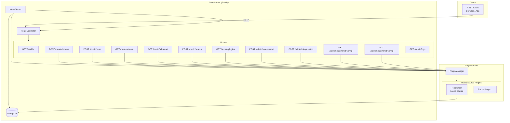

# Music Server – Architecture

The following diagram shows the main building blocks of the server and the relationships between them.

---

- [← README](../README.md)
- [Introduction](./introduction.md)
- [Building Blocks](./building-blocks.md)
- [API Reference](./api-reference.md)
